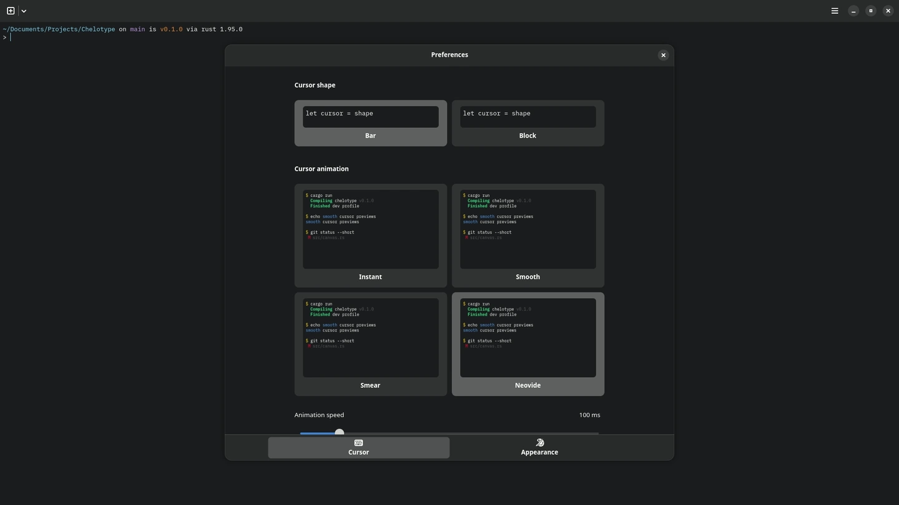

# Chelotype

<!-- chelotype-media-start -->
<p align="center">
  <a href="docs/media/chelotype-preferences.webm">
    
  </a>
</p>
<!-- chelotype-media-end -->

Chelotype is an opinionated GTK terminal. It supports mouse-driven interaction, smooth scrolling, direct launching into containers, Neovide-inspired cursor animations, customization, and more.

It is written in Rust and uses `libghostty-vt` as its terminal core.

## Highlights

- Launch tabs directly into the host, Toolbox, Distrobox, or Podman containers.
- Keep Flatpak installs useful with host/container commands launched through `flatpak-spawn --host`.
- Move around terminal input with the mouse, drag selections, copy primary/clipboard text, and resize split panes.
- Tune cursor shape, cursor animation, animation speed, font, palette, and smooth scrolling from the GTK preferences UI.
- Render terminal state from Ghostty grid snapshots with Chelotype's own GTK4/libadwaita renderer.

## Status

Chelotype is early, Linux-only, and actively changing. The app is usable for development workflows, but package repository and Flathub submission work is still in progress.

## Run From Source

```sh
bash scripts/with-zig.sh cargo run
```

The first build downloads Zig into `.tools/` because the vendored Ghostty terminal core is built with Zig.

Chelotype opens `fish` when it is available. To force a different shell:

```sh
CHELOTYPE_SHELL=/path/to/shell bash scripts/with-zig.sh cargo run
```

## Checks

```sh
bash scripts/with-zig.sh cargo fmt -- --check
bash scripts/with-zig.sh cargo clippy --all-targets -- -D warnings
bash scripts/with-zig.sh cargo test -- --test-threads=1
```

## Packaging

Desktop/AppStream metadata lives in `data/`.

```sh
PREFIX=/usr DESTDIR=/tmp/chelotype-root scripts/install-desktop-metadata.sh
```

Flatpak packaging lives in `packaging/flatpak/`.

```sh
flatpak-builder --user --disable-rofiles-fuse --install-deps-from=flathub --force-clean build-dir packaging/flatpak/com.chelokot.Chelotype.yml
```

Fedora packaging notes and the draft spec live in `packaging/fedora/`.

## Media

Regenerate the README video and Flathub screenshot with:

```sh
scripts/capture-flathub-media.sh
```

## License

Chelotype is licensed under `MIT OR Apache-2.0`.
